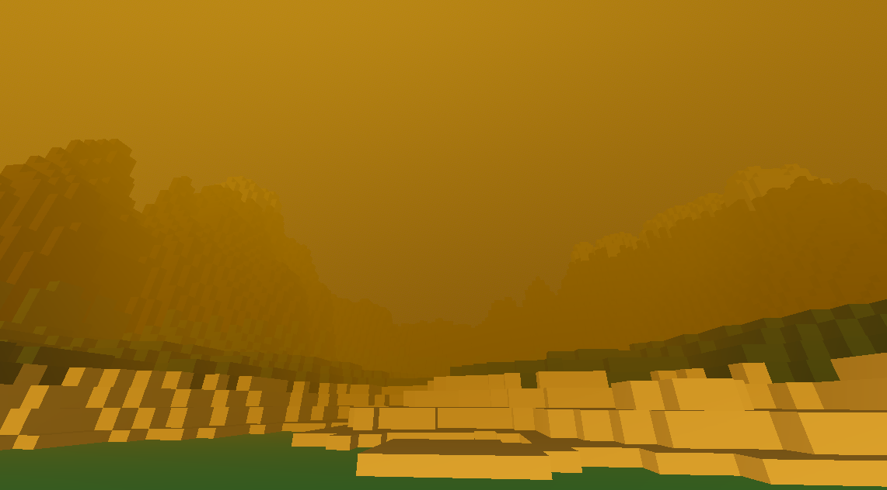
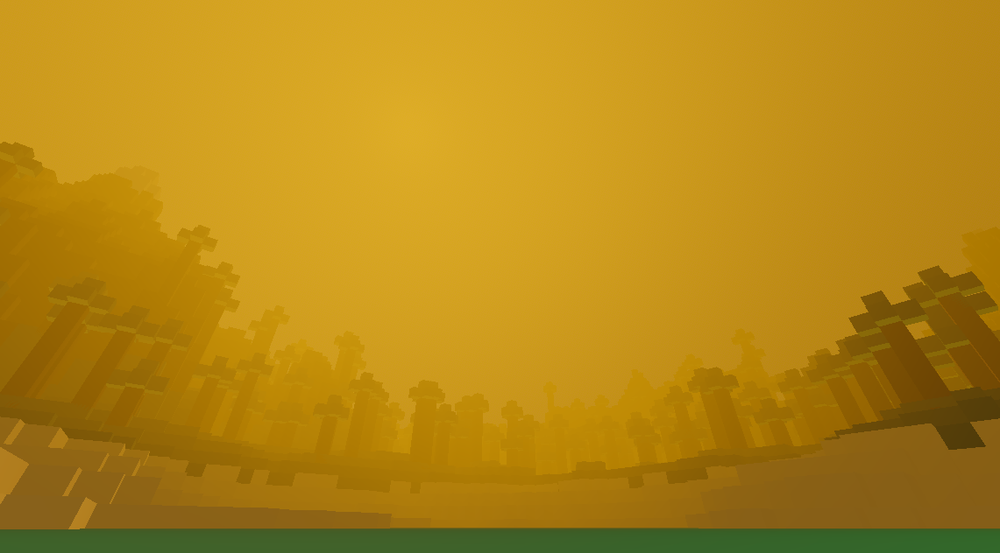

# Godot-Voxels-Test
## VoxelTool.gd
Used for building mesh out of individual voxel positions and colours

## TreeTool.gd
Used for creating tree's of varying heights at certain positions

## camera.gd
[Third party addon](https://github.com/richardhyy/simple-free-look-camera-4) used for controlling camera whilst game is running

## terrain.gd
Used for generating the heights to send to the VoxelTool using noise and a height mod curve

